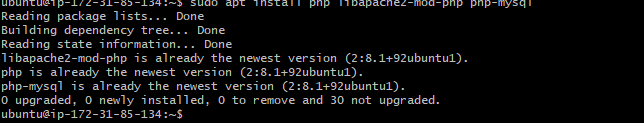
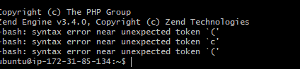

# WEB STACK IMPLIMENTATION USING AWS

Software Development Life Cycle (SDLC) is a process used by the software industry to design, develop and test high quality softwares. The SDLC aims to produce a high-quality software that meets or exceeds customer expectations, reaches completion within times and cost estimates. (FROM tutorialspoint.com)

## result i got while doing project 1

